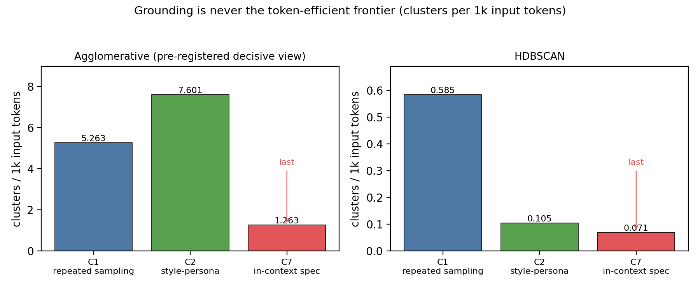

<div align="center">

# Grounding Doesn't Pay

### A token-matched negative result on creative diversity

Grounding a language model in a real, in-context **domain specification** buys more
creative diversity *per idea* — but never *per token*.<br>
A pre-registered, judge-free, budget-matched pilot behind that negative result.

[](LICENSE)
[](LICENSES/CC-BY-4.0.txt)
[](pyproject.toml)
[](.github/workflows/ci.yml)
<!-- DOI badge added at release: [](https://doi.org/<version-doi>) -->

</div>

> **In one line —** grounding helps; it just doesn't pay.

---

## TL;DR

Three ways to induce diversity at the generation stage — same model, same
temperature, same idea count, over two creative queries — measured as the number
of distinct domain-blind embedding clusters (tokens-matched, agglomerative):

| Arm | Input tokens | Clusters | **Clusters / 1k input tok** |
|---|---:|---:|---:|
| C1 — repeated sampling | 18,810 | 99 | **5.263** |
| C2 — style-persona (no substrate) | 19,076 | 145 | **7.601** |
| C7 — in-context domain spec | 127,470 | 161 | **1.263** &nbsp;← last |

The grounded spec (C7) produces the most clusters *per idea*, yet the **fewest per
token** — its 6.8× input-token cost dwarfs its 1.63× cluster gain (ceiling 1.8×).
Grounding helps; it just doesn't pay.

<div align="center">



</div>

---

## Install

```bash
pip install -r requirements.txt          # Track 1: verify + figures (light)
pip install -r requirements-full.txt     # Track 2: re-derive the scores (heavier)
```

## Quick start

```bash
python run_all.py
```

Expected output:

```
=== scripts/verify_chain.py
[PASS] artifact_root matches
[PASS] generation: 180 records re-verified (hash ties to content)
CHAIN INTACT
=== tests/test_paper_numbers.py
16/16 passed
=== scripts/make_figures.py
wrote output/figures/fig1_clusters_per_1k.png, fig2_caching_breakeven.png
```

`run_all.py` verifies the integrity chain, checks every headline number in the
paper against the frozen data, and regenerates the figures. Add `--with-rescore`
(needs `requirements-full.txt`) to re-embed and re-cluster the 180 frozen records
and reproduce the scores from scratch.

## Results

The full argument, tables, and caveats are in the paper
([`docs/paper/paper-final.pdf`](docs/paper/paper-final.pdf)). In one paragraph:
on the pre-registered tokens-matched view, grounding is never the efficient
frontier under **either** clustering algorithm or **either** embedding encoder;
it loses to plain repeated sampling per token in every budget unit (input tokens,
total tokens, USD) and under any prompt-caching regime constructible from these
tokens. It *does* add real per-proposal diversity over repeated sampling (+0.19 to
+0.26 clusters/idea) — a gain that is itself algorithm-scoped (it reverses under
HDBSCAN). Single model family (Grok-4.20), two creative queries.

## Repository layout

| Path | Contents |
|---|---|
| [`data/`](data) | Frozen pilot: `pilot_gen_full.jsonl` (180 records, SHA-256 each), `pilot_scores.json`, `pilot_posthoc.json`, `PREREGISTRATION.md`, `robustness/`. |
| [`code/`](code) | The harness: `score_pilot.py` (pre-registered scoring), `posthoc_analysis.py`, `pilot_common.py`, `pilot_config.json`, and `run_pilot_c1c7.py` (generation — frozen evidence, not runnable here). |
| [`scripts/`](scripts) | `make_figures.py`, `rescore_robustness.py`, and the provenance chain (`build_chain.py`, `verify_chain.py`, `hash_utils.py`). |
| [`tests/`](tests) | `test_paper_numbers.py` — every paper number ↔ the frozen data (stdlib only). |
| [`docs/paper/`](docs/paper) | The published paper (`.pdf`, `.docx`). |

## Integrity

The replication artifacts are sealed with a Merkle tree + hash chain;
`python scripts/verify_chain.py` recomputes it and exits non-zero if a single
byte changed. Two seals, kept honestly distinct: the **generation** records are
frozen evidence (an LLM at temperature 0.9 is not bit-reproducible — the chain
proves they were not altered, not that they regenerate); the **scores** are
reproducible from that frozen generation. See [`PROVENANCE.md`](PROVENANCE.md).

## What is and isn't claimed

- **Claimed** — grounded in-context specs are never the token-efficient frontier:
  invariant across both clustering algorithms, both embedding encoders, all three
  budget units, and any prompt-caching regime constructible from these tokens.
  Grounding *does* add per-proposal diversity over repeated sampling (+0.19 to
  +0.26 clusters/idea); it just never pays for it.
- **Scoped** — *which* cheap arm is the frontier is algorithm-dependent (style-persona
  under agglomerative, repeated sampling under HDBSCAN); the proposals-vs-tokens
  sign-flip lives on the agglomerative view and reverses under HDBSCAN. Both
  disclosed in the paper, not tuned away.
- **Not claimed** — that grounding is useless on any metric, that targeted retrieval
  would fail (untested), or that the result generalizes beyond Grok-4.20.

## Author

**Carlos Ulisses Flores** — Codex Hash Research Laboratory

[](https://orcid.org/0000-0002-6034-7765)
[](https://ulissesflores.com)
[](http://lattes.cnpq.br/6905246706890561)

## Citation

Cite the Zenodo Version DOI of the release (minted with the artifact; see
[`CITATION.cff`](CITATION.cff)). Until then:

```bibtex
@misc{flores2026grounding,
  author       = {Flores, Carlos Ulisses},
  orcid        = {https://orcid.org/0000-0002-6034-7765},
  title        = {Grounding Doesn't Pay: A Token-Matched Negative Result on Creative Diversity},
  year         = {2026},
  howpublished = {Codex Hash Research Laboratory, replication package},
  url          = {https://github.com/ulissesflores/grounding-doesnt-pay},
  note         = {Zenodo Version DOI minted at release}
}
```

## License

Dual-licensed: source code under **Apache-2.0** ([`LICENSE`](LICENSE)); paper text
and figures under **CC BY 4.0** ([`LICENSES/CC-BY-4.0.txt`](LICENSES/CC-BY-4.0.txt)).
See [`NOTICE`](NOTICE).
